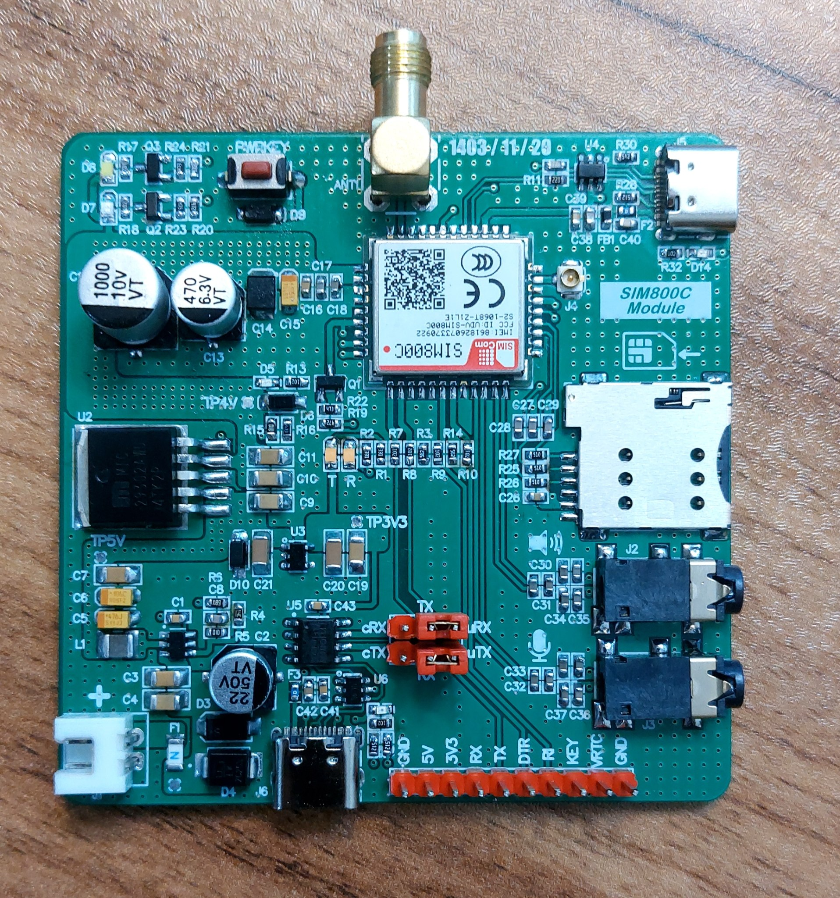
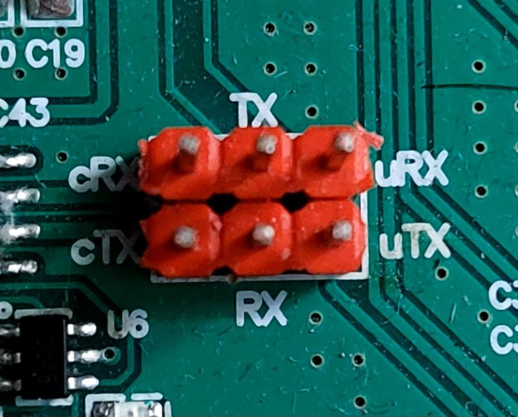

# 📱 SIM800C Development Board

This is a custom development board for the SIM800C GSM module. It is designed for ease of use in prototyping and development, offering all the essential interfaces and features in a compact and practical layout.

## 💡 Features

- **On-board USB to Serial Converter (CH340N):** Enables direct communication with the SIM800C module via USB Type-C.
- **PWRKEY Button:** Easily power the module on or off via a dedicated button.
- **Micro SIM Card Slot:** Convenient slot for inserting a micro SIM card.
- **Firmware Upgrade Port:** A dedicated USB interface to upgrade the SIM800C firmware directly.
- **Audio Interface:** Includes a connector for speaker output and microphone input.
- **Breakout Pins:** All essential SIM800C pins are broken out to a standard 2.54mm header for easy access.



## Applications

- IoT (Internet of Things) communication
- SMS / Call-based control systems
- Remote data monitoring
- GSM-based notification systems

## Getting Started

1. Insert a micro SIM card into the SIM card holder.
2. Selecting serial communication pins using jumpers. 
3. Install the **CH340** driver if it's not already installed.
4. Press the **PWRKEY** button for 1 second to turn on the SIM800C module.
5. There are two ways to communicate with the module :
- Using a on board **USB to serial** converter for direct communicate with M66 module and Use any serial terminal (like PuTTY or hterm) to communicate with the module via AT commands.
- Using a pin header for communication **MCU** with M66 module.
## Pinout

| Pin Name | Description         |
|----------|---------------------|
| GND      | Ground              |
| +5V      | Power               |
| +3V3     | Power               |
| MCU RX   | The microcontroller's RX pin should be connected to this pin.|
| MCU TX   | The microcontroller's TX pin should be connected to this pin.|
| DTR      | Data Terminal Ready |
| RING     | Incoming Call Indication |
| PWRKEY   | On/Off Module       |
| VRTC     | Power supply for RTC|
| GND      | Ground |


## Notes



- To use the converter, the jumpers must be connected in such a way that TX is connected to cRX and RX is connected to cTX.
- To communicate with the MCU, jumpers must be set so that TX is connected to uRX and RX is connected to uTX.
```
TX  -> Module Transmit pin
RX  -> Module Receive pin
uRX -> Microcontroller Receive pin
uTX -> Microcontroller Transmit pin
cRX -> CH340n Receive pin
cTX -> CH340n Transmit pin
```

## License

This project is open-source and released under the [MIT License](LICENSE).

## Author

Designed by [Mehrdad Qasemi Taj](https://github.com/Mehrdad-QasemiTaj)

---


